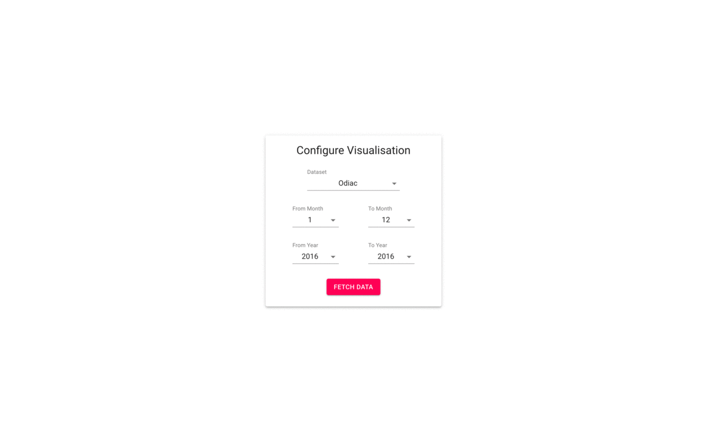

# Science Hack 2019 Website

See the official website at **https://science-hack-2019.herokuapp.com/**.

### Tech Stack

* **Frontend: [React (JS)](https://reactjs.org/)**
* **Backend: [Flask](https://flask.palletsprojects.com/en/1.1.x/)**

 

* **Using the [Heroku](https://www.heroku.com/) Pipline**
* **Hosted on [AWS](https://aws.amazon.com/de/)**

 

* **File Storage with [Google Cloud Storage](https://cloud.google.com/products/storage)**

 

* **Design Guideline by [Google Material](https://material.io/)**
* **React Design Components by [Material UI](https://material-ui.com/)**
* **With the help of [SCSS](https://sass-lang.com/)**

